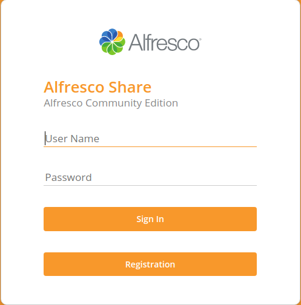
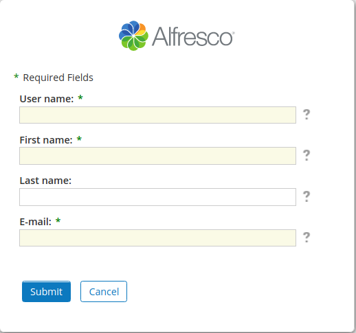
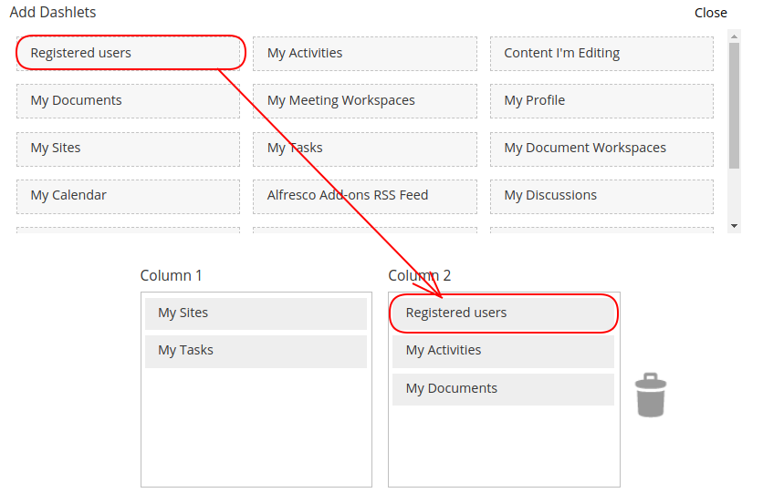
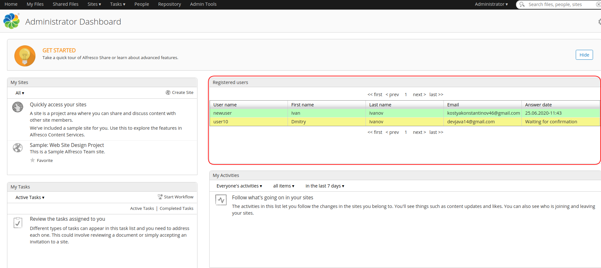
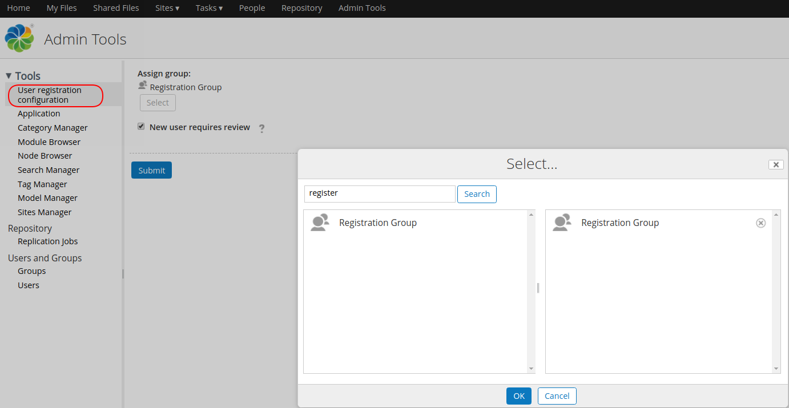
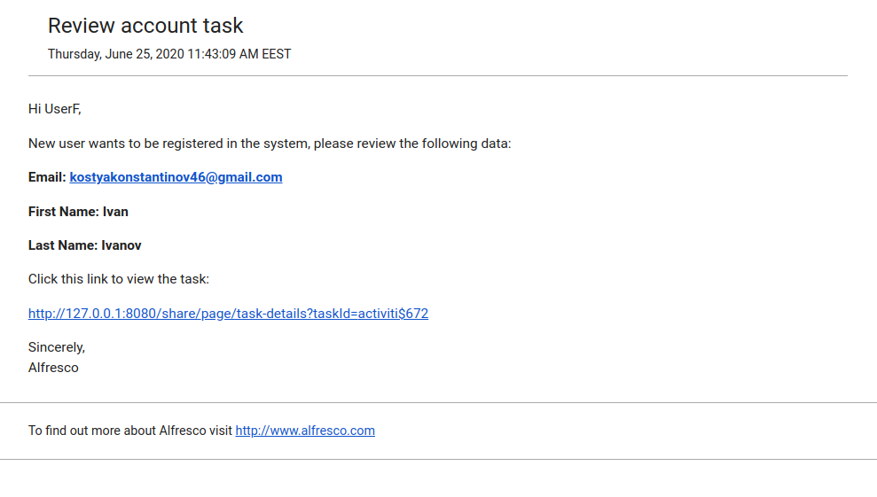
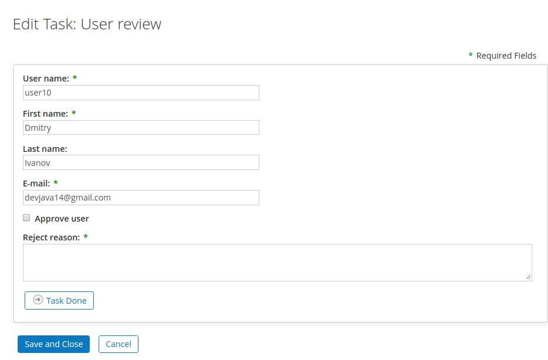
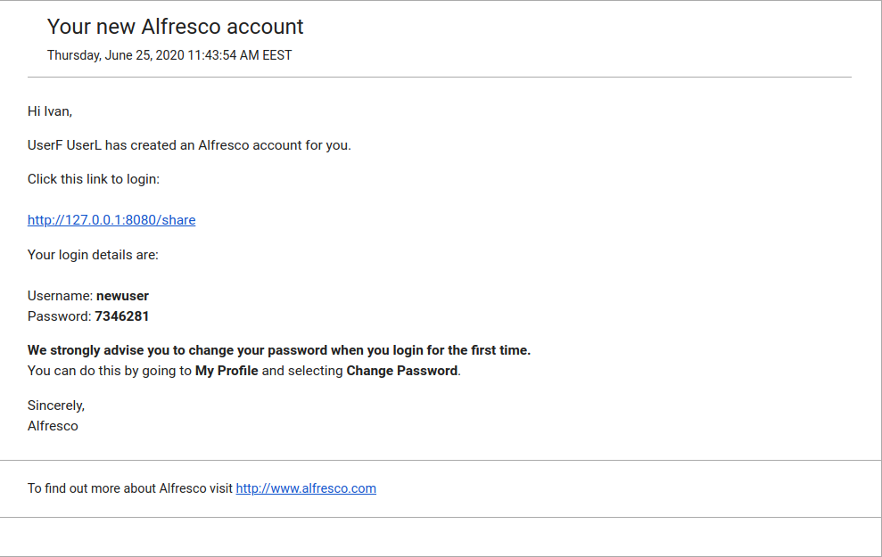

# Alfresco Registration add-on

Alfresco Registration add-on allows registration of users by their own using new registration page.  

 

# Features
 - view the status of newly registered users in special table
 - Add group with users,who will be able to approve or reject new registered users
 - Sends email notification to users who were assigned to review registration request
 - Approve or reject new registered users in special window
 - Sends email notification status to new registered users with login and password

 # Compatibility was tested on versions:
  - Alfresco 5.2
  - Alfresco 6.0.7
  - Alfresco 6.2.0
 
 # How to build
 ### The following tools must be installed:
 - Java8
 - Maven3
  ###Required settings
  - You have to configure Alfresco Outbound SMTP in {ALFRESCO LOCATION}/tomcat/shared/classes/alfresco-global.properties.
  ```sh
   mail.host={mail host}
   mail.port={mail port}
   mail.username={mail username}
   mail.password={mail password}
   mail.protocol=smtps
   mail.smtps.starttls.enable=true
   mail.smtps.auth=true
   mail.from.enabled=false
   mail.from.default={default sending email}
   ```
 
 ### Build steps
 1. Clone repo
 ```sh
 $ git clone https://github.com/FlexSolution/AlfrescoRegistrationAddon.git
 ```
 2. Compile repo amp 
 
 ```sh
 $ cd AlfrescoRegistrationAddon/registration-repo
 $ mvn clean package
 ```
 
 3. Compile share amp
 
 ```sh
 $ cd ../registration-share
 $ mvn clean package
 ```
 
 # How to deploy add-on to Alfresco
 
 1. Compile AMPs for alfresco and share how described above
 2. Stop Alfresco
 3. Copy file AlfrescoRegistrationAddon/registration-repo/target/registration-repo.amp into ${Alfresco_HOME}/amps folder
 4. Copy file AlfrescoRegistrationAddon/registration-share/target/registration-share.amp into ${Alfresco_HOME}/amps_share folder
 5. Apply AMPs by executing command from command line
 ```sh
 $ cd ${Alfresco_HOME}/bin
 $ apply_amps.sh -force
 ```
 6. Start Alfresco
 
# User's manual
### Adding a special table to dashboard for displaying new registered users.
Go to Customize Dashboard and add Registered Users dashboard.
 
 
 
 
### Registration without adding users to registration configuration
If you don't add a group with users,who will approve or reject new registered users,
add-on will approve new registered user,add him to system and send a notification email
with new login and password.

### Registration with adding users to registration configuration
If you want to assign certain group of users,who will approve or reject new registered 
users, you have to:
 - Add these groups to User Registration Configuration tool and click submit
  
  
  
 - When new user registered,users in these groups receive an email with 
 new user registered notification
 
 
 
 - After clicking task link user will be able to approve or reject new registered user
 in special window
 
 
 
 - When new registered user is approved or rejected,he will receive email notification
 about his status
 
 
 
 
 


